<div align="center">

# hypr-dotfiles

**A complete, themeable Hyprland desktop for Arch Linux.**<br>
Lua-configured Hyprland · a hand-built Quickshell shell · one palette for every app


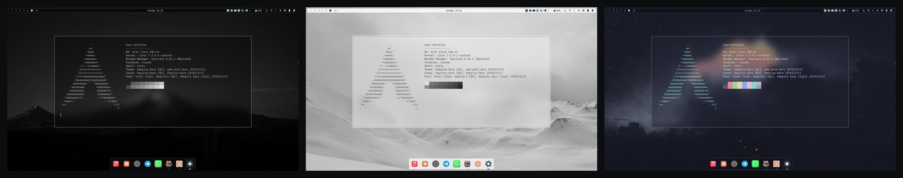

[Themes](#themes) · [Features](#features) · [Install](#install) · [Keybinds](#keybinds) · [Customise](#make-it-yours) · [Help](#troubleshooting)

</div>

---

## Themes

Four themes ship with it. Switch live with **`SUPER` `CTRL` `SHIFT` `SPACE`**. Every app changes
with it: the shell, terminals, GTK and Qt apps, Neovim, btop, VS Code, Firefox, Spotify and the
login screen.

<table>
<tr>
<td width="25%" align="center"><b>HyprMono</b><br><sub>dark · greys only</sub></td>
<td width="25%" align="center"><b>HyprMono Light</b><br><sub>the same design on white</sub></td>
<td width="25%" align="center"><b>Catppuccin Mocha</b><br><sub>the official Mocha palette</sub></td>
<td width="25%" align="center"><b>Starlink</b><br><sub>ringed giant · ice-teal on deep space</sub></td>
</tr>
<tr>
<td>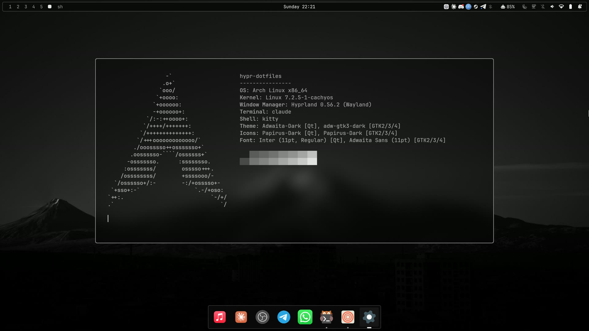</td>
<td>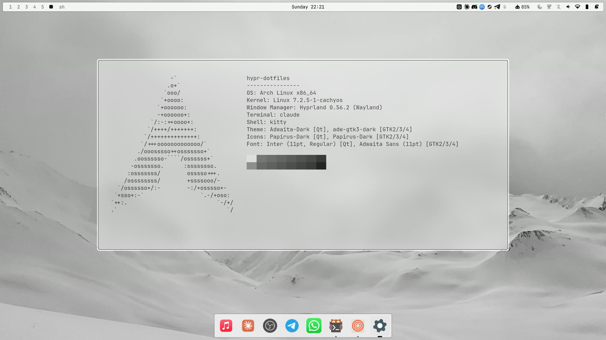</td>
<td></td>
<td>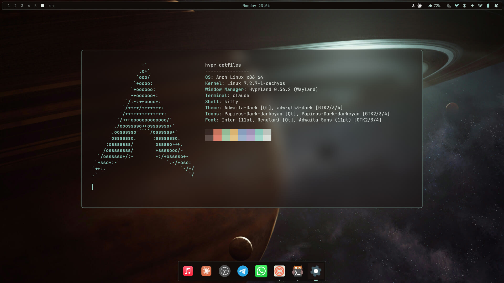</td>
</tr>
<tr>
<td></td>
<td></td>
<td></td>
<td>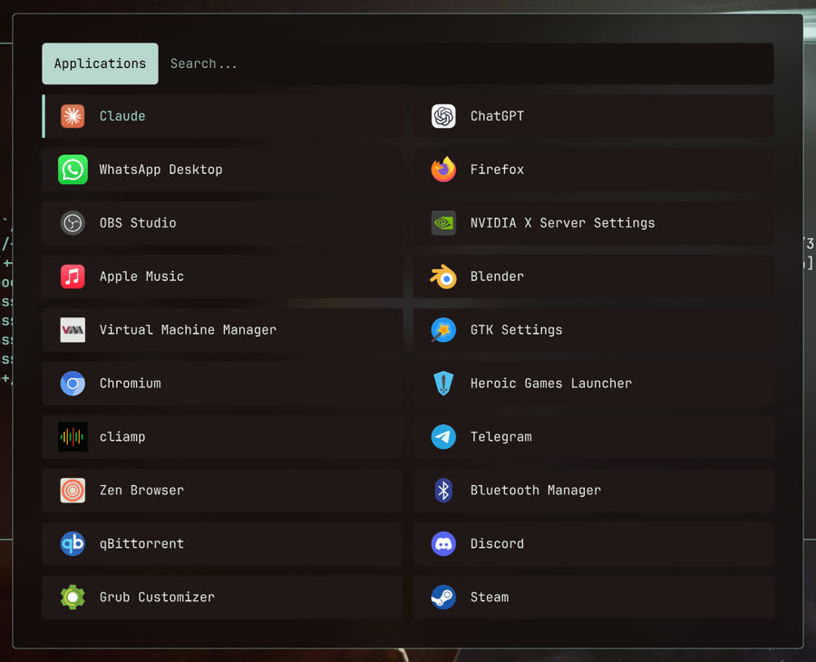</td>
</tr>
<tr>
<td>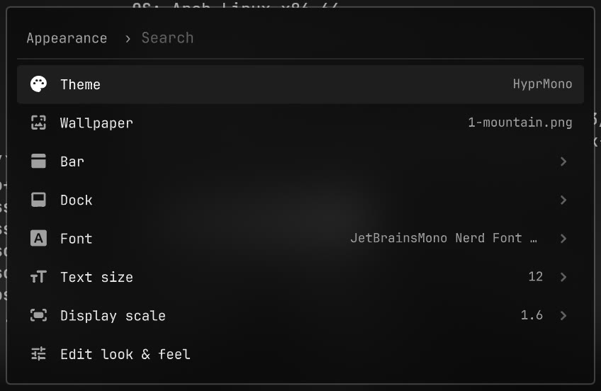</td>
<td>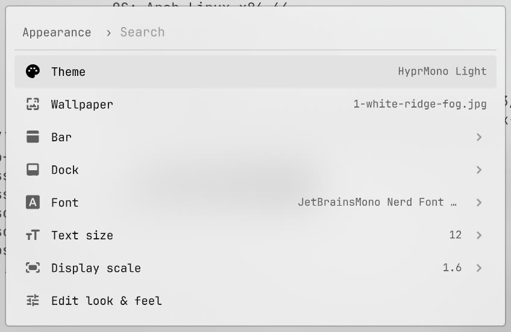</td>
<td></td>
<td>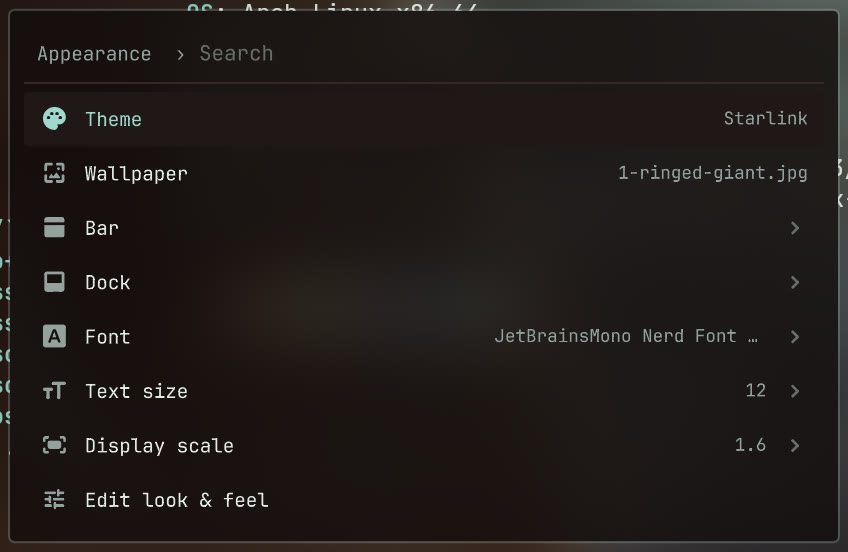</td>
</tr>
<tr>
<td>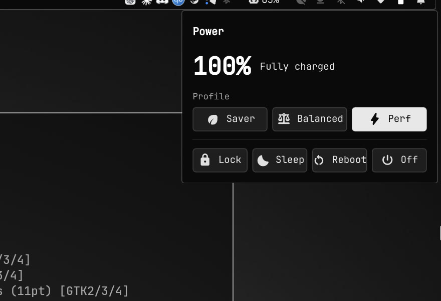</td>
<td>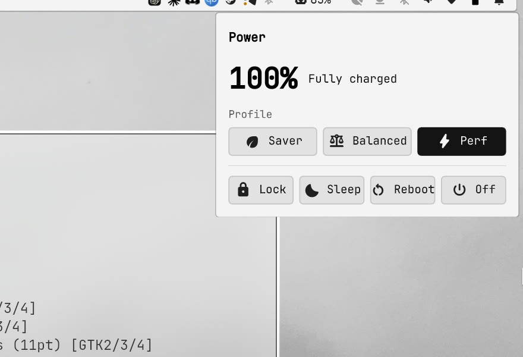</td>
<td>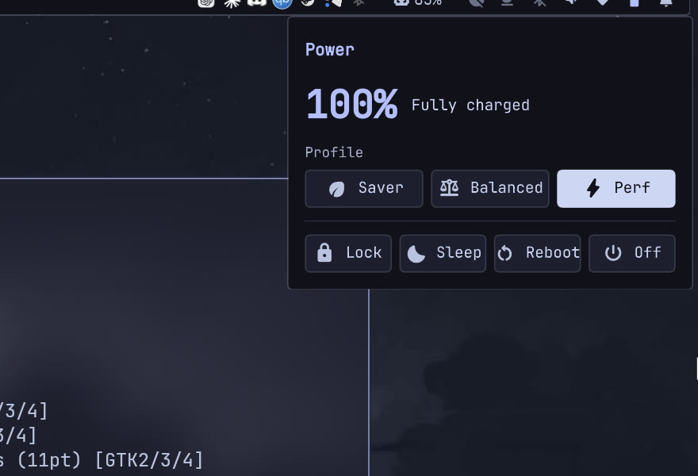</td>
<td>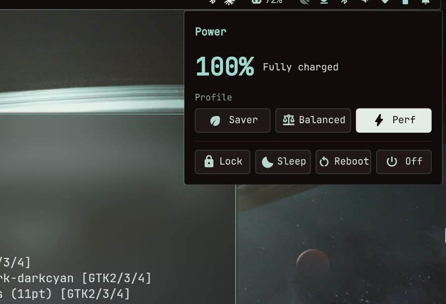</td>
</tr>
</table>

<sub>Top to bottom: the desktop, the launcher (<code>SUPER D</code>), the menu (<code>SUPER SPACE</code>) and the power panel (click the battery).</sub>

---

## Features

| | |
|---|---|
| **Bar** | Three styles (Legacy, Floating, Minimal) on any screen edge. Drag it to move it; show or hide each widget from the menu |
| **Dock** | Pinned and running apps: always visible, auto-hide, or hidden while a window covers it |
| **Menu** | `SUPER SPACE`: every setting in one searchable list |
| **Launcher** | Fuzzy app search that learns what you use, plus clipboard history with image previews |
| **Panels** | Sound, Wi-Fi, Bluetooth and power profiles, dropping down from the bar |
| **Theme engine** | One `colors.toml` colours every app, dark or light. Make your own in minutes |
| **Desktop extras** | Notifications with do-not-disturb, lock screen, power menu, volume and brightness OSD, night light, idle lock, caffeine |
| **Login screen** | An SDDM theme that matches the lock screen |
| **AI agents** | Claude Code usage in the bar, and a `/hypr` skill that lets an agent theme and fix the rice for you |

---

## Install

> **You need:** Arch Linux or an Arch-based distro (CachyOS, EndeavourOS…), a user with `sudo`,
> and a GPU that runs Wayland. In a VM, turn on 3D acceleration (virt-manager: Virtio GPU with
> OpenGL).

```bash
sudo pacman -Syu --needed git
git clone https://github.com/thomasmartinoa/hypr-dotfiles.git ~/hypr-dotfiles
cd ~/hypr-dotfiles && ./install.sh
```

Reboot, choose **Hyprland** on the login screen, and you're in. Run `./install.sh --dry-run` first
if you'd like to see the plan without changing anything.

<details>
<summary><b>What the installer does</b></summary>

1. Installs every package the desktop needs: the repo ones with pacman, and three from the AUR
   (it offers to build `yay` if you have no AUR helper).
2. Moves any existing configs that are in the way into a backup folder under `~/.config/`,
   after asking you.
3. Links the configs into your home with GNU Stow, so the repo stays the one source.
4. Applies the default theme.
5. Enables NetworkManager, Bluetooth, power profiles and SDDM. It leaves a service alone if you
   already use something else for it.
6. Installs the login-screen theme and a small helper, so theme changes also reach the login
   screen.

It's safe to run again, and it never deletes or overwrites your files.

| Flag | |
|---|---|
| `--dry-run` | Show what would happen, change nothing |
| `--stow-only` | Skip installing packages |
| `--migrate` · `--no-migrate` | Back up blocking files without asking · never move anything |
| `--skip-root` | Don't touch `/root`, SDDM or sudoers |
| `--no-aur` | Skip the AUR packages |

</details>

### Optional: Spotify

Spotify follows the theme through [Spicetify](https://spicetify.app/). Install both, then apply
the theme once:

```bash
yay -S spotify-launcher spicetify-cli
spicetify config spotify_path ~/.local/share/spotify-launcher/install/usr/share/spotify
hypr-theme reload
```

From then on every theme switch recolours Spotify. It restarts Spotify if nothing is playing;
otherwise the new colours show the next time it starts. After a Spotify update, run
`spicetify backup apply` again.

### Coding agents in the terminal

Claude Code draws its own colours. Set it to follow the terminal once, with
`/theme` → **Auto (match terminal)**; after that it switches with the rice's dark and light
themes.

### First steps

- Press **`SUPER SPACE`** to open the menu. Everything is in there: theme, wallpaper, bar,
  dock, fonts, Wi-Fi, keybindings.
- **Monitor:** every screen starts at its preferred resolution, with the scale picked
  automatically. To choose your own, use Menu › Appearance › Display scale, or add a rule to
  `~/.config/hypr/modules/monitors.local.lua`, for example:
  ```lua
  hl.monitor({ output = "eDP-1", mode = "2560x1440@165", position = "auto", scale = 1.6 })
  ```
  `hyprctl monitors all` lists your outputs. This file is yours; updates never touch it.
- **Updating later:** run `cd ~/hypr-dotfiles && git pull && ./install.sh`.

---

## Keybinds

| Keys | Action |
|---|---|
| `SUPER` `Return` | Terminal |
| `SUPER` `D` · `V` | App launcher · clipboard history |
| `SUPER` `SPACE` | The menu |
| `SUPER` `E` · `B` | File manager · browser |
| `SUPER` `Q` · `T` · `F` | Close · float · fullscreen |
| `SUPER` `1`–`0` | Go to workspace (add `SHIFT` to move the window there) |
| `SUPER` `L` · `M` | Lock screen · power menu |
| `SUPER` `CTRL` `SHIFT` `SPACE` | Theme picker |
| `Print` | Screenshot a region (Esc or `Print` again cancels) |
| `SUPER` `SHIFT` `Print` | Screenshot a window: click the one you want |

<details>
<summary><b>All keybinds</b></summary>

| Keys | Action |
|---|---|
| `SUPER` `CTRL` `O` | The menu, opened on Toggle |
| `SUPER` `R` | Restart the shell |
| `SUPER` `SHIFT` `B` | Bar style: Legacy → Floating → Minimal |
| `SUPER` `CTRL` `I` | Caffeine: pause idle lock and suspend |
| `SUPER` `SHIFT` `W` · `SUPER` `CTRL` `SPACE` | Wallpaper picker · next wallpaper |
| `SUPER` `A` | Launch the default coding agent |
| `SUPER` `SHIFT` `F` · `SUPER` `J` | Maximize · toggle split |
| `SUPER` arrows | Move focus |
| `SUPER` `SHIFT` arrows | Move the window |
| `SUPER` `CTRL` arrows | Resize the window (hold to keep going) |
| `SUPER` + drag with left / right mouse button | Move · resize a window |
| `SUPER` scroll · 3-finger swipe | Cycle workspaces |
| `SUPER` `S` · `SHIFT` `S` | Scratchpad · move a window to it |
| `SUPER` `Print` | Screenshot the whole screen |

Screenshots are saved to `~/Pictures/screenshot/` and copied to the clipboard. Media, volume and brightness keys work too,
even on the lock screen. The full list is in
[`modules/binds.lua`](hyprland/.config/hypr/modules/binds.lua) and under Menu › Learn.

</details>

---

## Make it yours

- **Themes:** copy `theme/.config/hypr-theme/themes/hyprmono/`, edit its `colors.toml`, put a
  wallpaper in `backgrounds/`, then run `hypr-theme set <name>` and `hypr-theme-preview <name>`
  (a real screenshot for the theme picker). Your themes stay private; git
  ignores them.
- **Bar and dock:** use Menu › Appearance › Bar / Dock for the style, edge, transparency, widgets and
  pinned apps.
- **Look and feel:** use Menu › Appearance for font, text size and display scale, and *Edit look &
  feel* for gaps, blur and animations.
- **Your own menu entries** go in `~/.config/hypr-theme/menu.local.jsonc`.

<details>
<summary><b>More: command modules, theme details, the agent skill</b></summary>

**Command modules.** Any script that prints text can become a bar widget. Add it under
`modules` in `~/.config/hypr-theme/shell.json` and put its id in a layout list:

```json
"modules": { "vpn": { "exec": "~/bin/vpn-status", "interval": 5, "onClick": "nm-connection-editor" } }
```

**Themes in depth.** In `colors.toml`, `mode = "light"` switches GTK, Qt and Neovim to their
light variants, and `hued = true` gives apps their stock colours. The shell, kitty, Neovim,
btop, GTK4 and VS Code follow a switch live. GTK3 apps, Qt apps, Alacritty and Firefox's UI pick
it up the next time they start. Useful commands: `hypr-theme list`, `hypr-theme toggle`,
`hypr-wall next`.

**The `/hypr` skill.** If you use Claude Code, Codex, OpenCode or Gemini, the installer links a
`/hypr` skill into them. Ask something like *"make a warm dark theme called ember"* or *"why is
my wifi dropping"*. It follows the rice's own guides, checks its work in both light and dark,
and never commits anything for you.

</details>

---

## Troubleshooting

| Problem | Fix |
|---|---|
| Something looks wrong | `hypr-doctor --print` prints a full, no-sudo diagnostics report |
| Boxes instead of icons or text | `fc-list \| grep -i "JetBrainsMono Nerd Font Propo"` should print a line; if not, `sudo pacman -S ttf-jetbrains-mono-nerd` |
| The login screen is black | From a TTY (`Ctrl` `Alt` `F3`): `sudo rm /etc/sddm.conf.d/10-wayland.conf`, then reboot |
| The Wi-Fi panel is empty | Your network is run by something other than NetworkManager. The installer prints how to switch |
| The bar or dock is missing | `SUPER` `R` restarts the shell; `qs log` shows why it stopped |

---

<details>
<summary><b>Repository layout</b></summary>

```
hyprland/     ~/.config/hypr/          Hyprland (Lua): modules/, scripts/
quickshell/   ~/.config/quickshell/    the shell: bar, dock, launcher, menu, panels, lock, notifications
theme/        ~/.config/hypr-theme/    themes, templates, engine, menu; ~/.local/bin/hypr-* tools
kittyterminal/ alacritty/ nvim/ zsh/ starship/ gtk/    terminals, LazyVim, prompt, GTK css
waybar/ rofi/ swaync/ wlogout/         classic fallback, used only if the shell isn't running
sddm/                                  login screen (installed by install.sh)
```

</details>

## Credits

Built on [Hyprland](https://hyprland.org/), [Quickshell](https://quickshell.org/),
[LazyVim](https://www.lazyvim.org/) and [Catppuccin](https://catppuccin.com/). Icons are Google's
[Material Symbols](https://fonts.google.com/icons) (Apache 2.0). Plenty of ideas come from
[Omarchy](https://omarchy.org/).

**Wallpapers** aren't mine and aren't covered by the licence. HyprMono's is Mount Ararat over
Yerevan (photographer unknown). The light, Catppuccin and Starlink wallpapers came from
wallpaper sites (Starlink's is wallhaven 7jeozo) without a traceable author. If one is yours, open an issue and it will be credited or removed.

The configuration is [MIT](LICENSE).
