<div align="center">

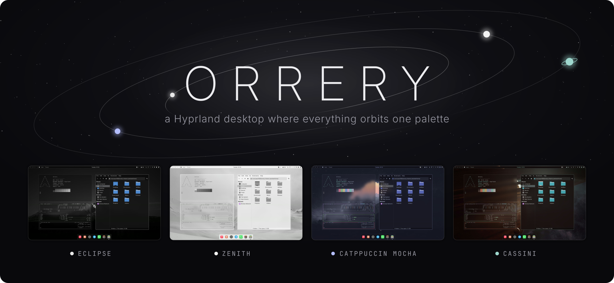

**A complete, themeable Hyprland desktop for Arch Linux.**<br>
Switch the theme and everything follows: the shell, terminals, GTK and Qt apps, Neovim,
VS Code, Firefox, Spotify and the login screen.


[Themes](#themes) · [Features](#features) · [Install](#install) · [Make it yours](#make-it-yours) · [Keybinds](#keybinds) · [Help](#troubleshooting)

</div>

https://github.com/user-attachments/assets/58c2fadd-e5d2-4d45-b2a2-b829e290feee

## Themes

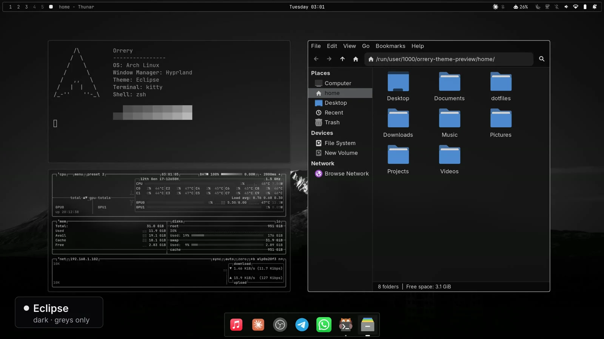

Four themes ship with it. Switch live with **`SUPER` `CTRL` `SHIFT` `SPACE`**, or make your own
([below](#make-it-yours)). Open one for a closer look:

<details>
<summary><b>Eclipse</b> · dark · greys only</summary>
<br>
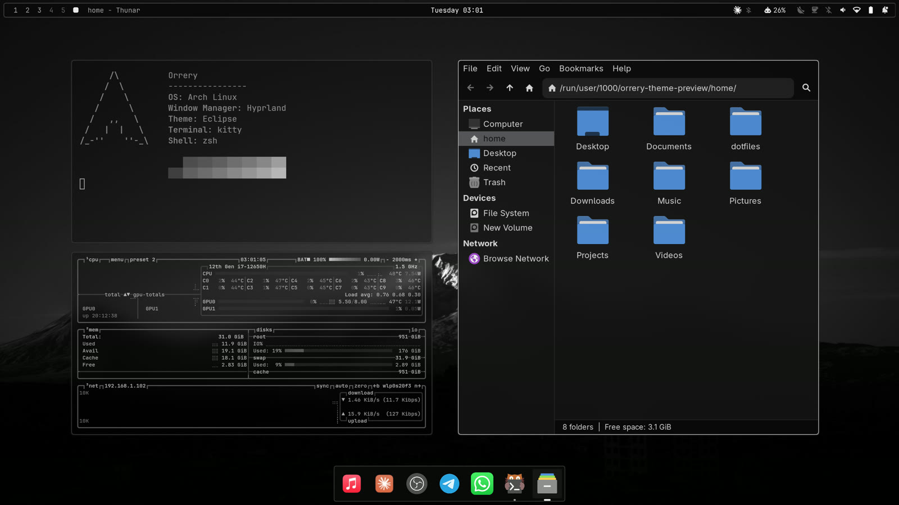
<table>
<tr>
<td width="50%">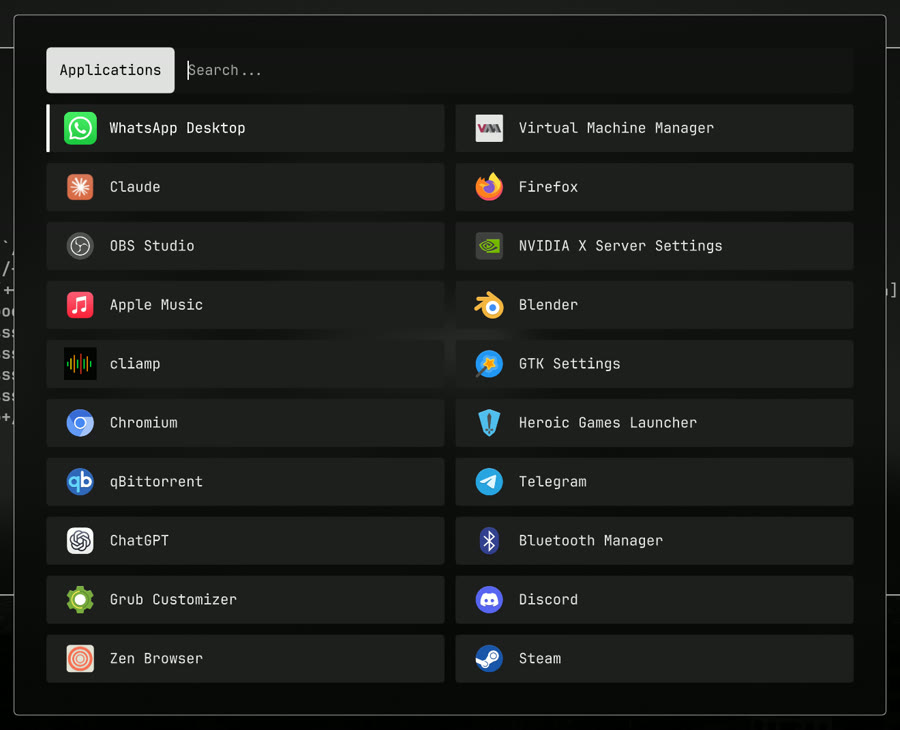</td>
<td width="50%">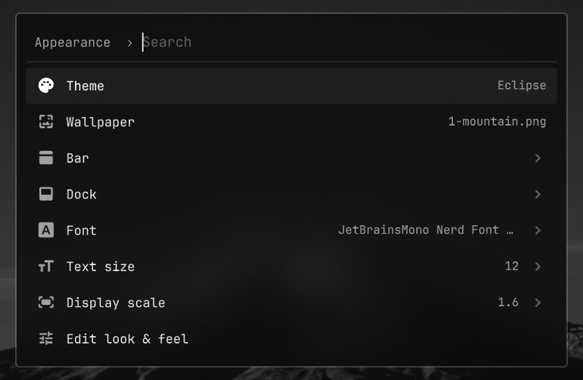</td>
</tr>
</table>
</details>
<details>
<summary><b>Zenith</b> · the same design on white</summary>
<br>
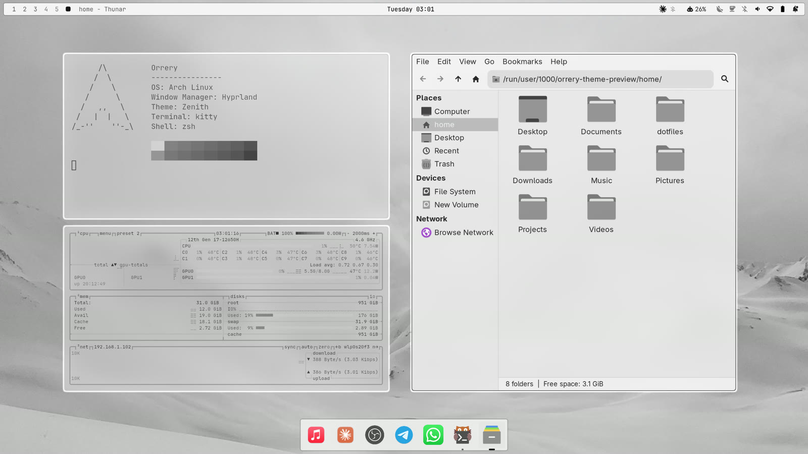
<table>
<tr>
<td width="50%">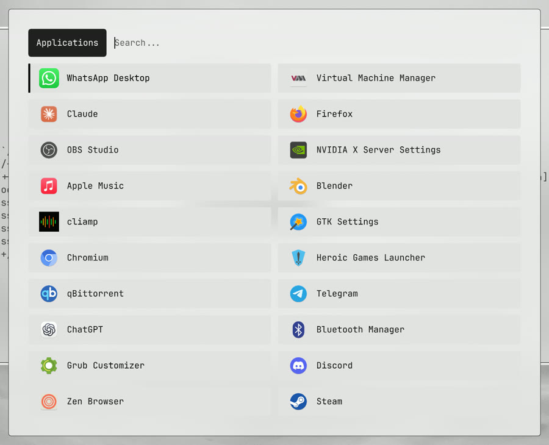</td>
<td width="50%">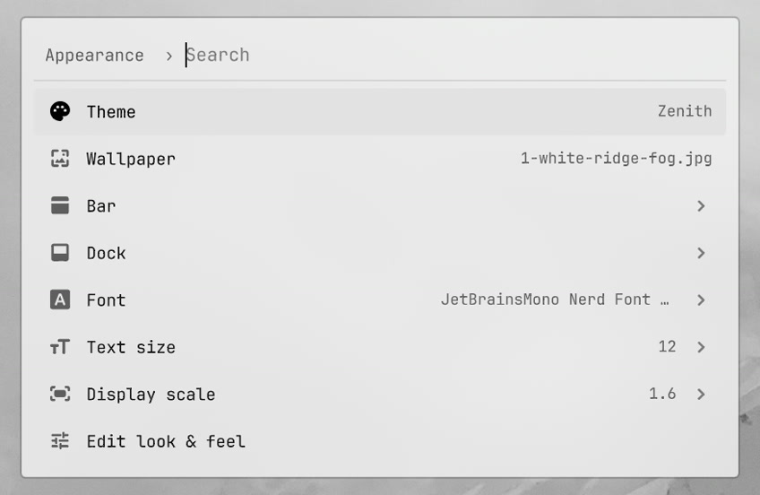</td>
</tr>
</table>
</details>
<details>
<summary><b>Catppuccin Mocha</b> · the official Mocha palette</summary>
<br>
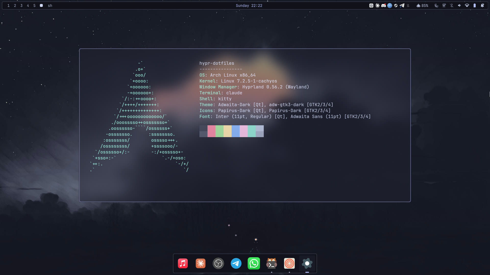
<table>
<tr>
<td width="50%">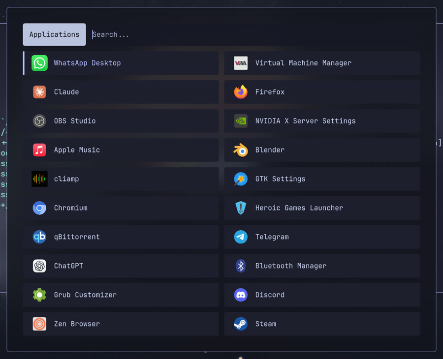</td>
<td width="50%">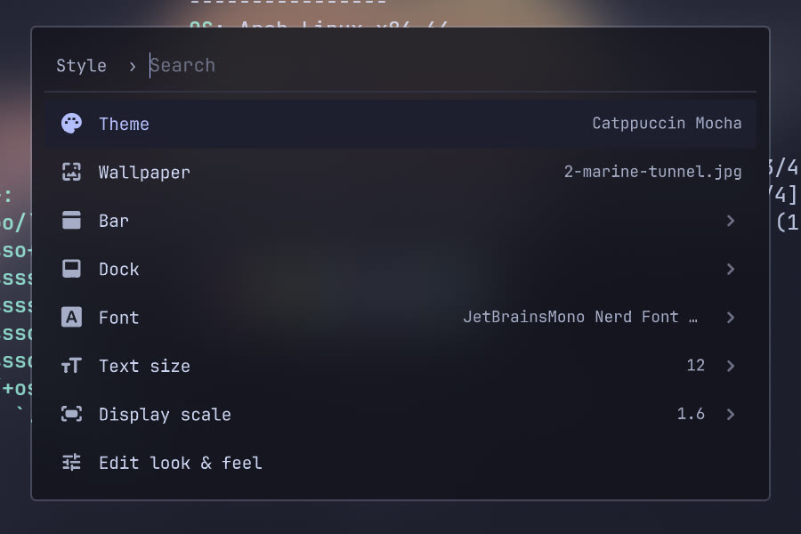</td>
</tr>
</table>
</details>
<details>
<summary><b>Cassini</b> · ringed giant · ice-teal on deep space</summary>
<br>
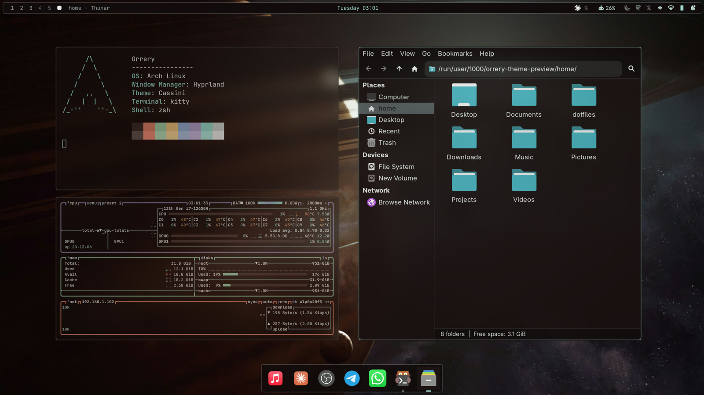
<table>
<tr>
<td width="50%"></td>
<td width="50%">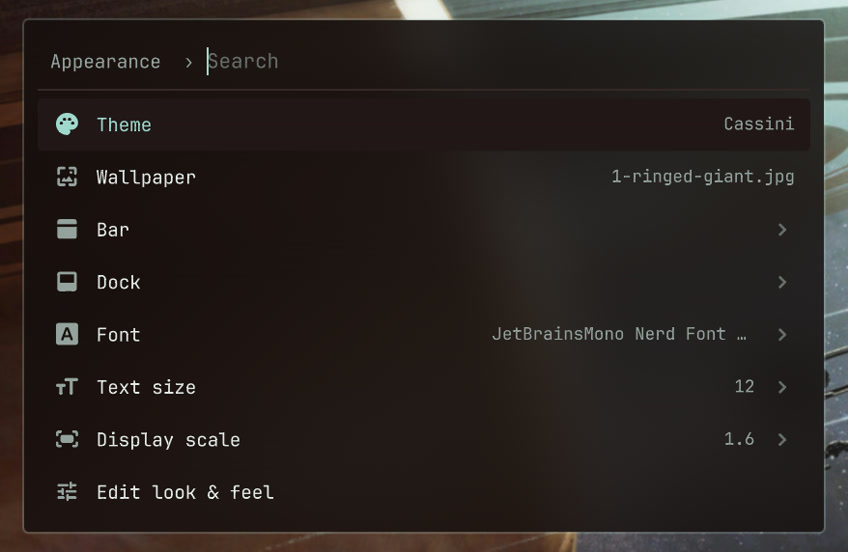</td>
</tr>
</table>
</details>

## Features

- **One palette, every app.** A theme colours the shell, kitty, Neovim, btop, GTK and Qt apps,
  VS Code, Firefox, Spotify and the login screen, dark or light. Most follow a switch instantly.
- **An AI skill that knows the rice.** Claude Code, Codex, OpenCode and Gemini get an `/orrery`
  skill: ask for a new theme, a bar widget or a fix in plain words.
- **A hand-built shell** on [Quickshell](https://quickshell.org/): a bar in three styles on any
  screen edge, a dock, notifications, lock screen, power menu and on-screen volume and brightness.
- **One menu for everything.** `SUPER` `SPACE` opens a searchable menu: theme, wallpaper, bar,
  dock, fonts, Wi-Fi, Bluetooth, keybindings.
- **Launcher and clipboard.** Fuzzy app search that learns what you use, and clipboard history
  with image previews.
- **Web apps.** Turn any site into an app with its own window, icon, launcher entry and dock
  icon: Menu › Web apps, or `orrery-webapp add https://mail.example.com`.
- **Panels that grow out of the bar**: sound with per-app volume, Wi-Fi, Bluetooth pairing,
  power (battery, brightness, profiles), notifications, calendar and media, all in one
  Material 3 motion.
- **A power menu** (`SUPER` `M`) with lock, log out, sleep, hibernate, restart and shut down.
- **A careful installer.** It backs up anything in the way, is safe to run again, and has a
  `--dry-run`.

## Install

> **You need** Arch Linux or an Arch-based distro (CachyOS, EndeavourOS…), a user with `sudo`
> and a GPU that runs Wayland. In a VM, turn on 3D acceleration.

```bash
sudo pacman -Syu --needed git
git clone https://github.com/thomasmartinoa/Orrery-dotfiles.git ~/Orrery-dotfiles
cd ~/Orrery-dotfiles && ./install.sh
```

Reboot, choose **Hyprland** on the login screen, and press **`SUPER` `SPACE`** to find
everything. To update later: `cd ~/Orrery-dotfiles && git pull && ./install.sh`.

<details>
<summary><b>What the installer does</b></summary>

1. Installs every package the desktop needs: the repo ones with pacman, and three from the AUR
   (it offers to build `yay` if you have no AUR helper).
2. Moves any existing configs that are in the way into a backup folder under `~/.config/`,
   after asking you.
3. Links the configs into your home with GNU Stow, so the repo stays the one source.
4. Applies the default theme.
5. Enables NetworkManager, Bluetooth, power profiles and SDDM. It leaves a service alone if you
   already use something else for it.
6. Installs the login-screen theme and a small helper, so theme changes also reach the login
   screen.

It's safe to run again, and it never deletes or overwrites your files.

| Flag | |
|---|---|
| `--dry-run` | Show what would happen, change nothing |
| `--stow-only` | Skip installing packages |
| `--migrate` · `--no-migrate` | Back up blocking files without asking · never move anything |
| `--skip-root` | Don't touch `/root`, SDDM or sudoers |
| `--no-aur` | Skip the AUR packages |

</details>

<details>
<summary><b>Keyboard, browser, monitor, Spotify and Claude Code</b></summary>

**Keyboard layout** is US. Put your own in `~/.config/hypr/hyprland.local.lua` (yours;
updates never touch it), then `hyprctl reload`:

```lua
hl.config({ input = { kb_layout = "de" } })
```

Any other Hyprland setting can go in that file too; it's loaded last, so it wins.

**Web apps** open in Firefox or Chromium, picked for each app when you add it (Menu › Web
apps › Add a web app › In Firefox / In Chromium, or `orrery-webapp add --firefox|--chromium`).
Firefox gives each app a bare window with its own logins and no link preview; Chromium uses
its app mode, with logins shared with the browser (Chrome, Brave, Vivaldi and Edge work too).
No scrollbars either way.

**A browser** isn't installed for you. `SUPER` `B` opens the first one it finds of Zen, Firefox,
Chromium and Brave; pick another in Menu › Settings › Default apps.

**Monitor.** Every screen starts at its preferred resolution with an automatic scale. Pick a
scale in Menu › Appearance › Display scale, or add an exact rule to
`~/.config/hypr/modules/monitors.local.lua` (yours; updates never touch it):

```lua
hl.monitor({ output = "eDP-1", mode = "2560x1440@165", position = "auto", scale = 1.6 })
```

**Spotify** follows the theme through [Spicetify](https://spicetify.app/):

```bash
yay -S spotify-launcher spicetify-cli
spicetify config spotify_path ~/.local/share/spotify-launcher/install/usr/share/spotify
orrery-theme reload
```

After a Spotify update, run `spicetify backup apply` again.

**Claude Code** draws its own colours: run `/theme` in it once and pick **Auto (match
terminal)**, and it switches with the rice's dark and light themes.

</details>

## Make it yours

### A theme of your own, by asking

If you use Claude Code, Codex, OpenCode or Gemini CLI, the installer links the `/orrery` skill
into it. Describe what you want:

> make a warm dark theme called ember from my wallpaper ~/Pictures/forest.jpg

The agent picks a palette from the image, colours every app, checks that text stays readable
everywhere, screenshots the result for the theme picker and switches to it. It never commits or
pushes anything. The same skill takes requests like *"add a CPU temperature widget to the bar"*
or *"why is my Wi-Fi dropping?"*.

### A theme of your own, by hand

```bash
cd ~/.config/orrery/themes
cp -r eclipse ember && rm ember/backgrounds/* ember/preview.jpg
cp ~/Pictures/forest.jpg ember/backgrounds/1-forest.jpg
$EDITOR ember/colors.toml        # the name, mode = "dark"|"light", and the colours
orrery-theme set ember
orrery-theme-preview ember       # a real screenshot for the theme picker
```

Set `hued = true` for coloured apps (btop, Neovim, battery and warnings) instead of greys. Themes
you make stay on your machine: git ignores them.

### Everything else

- **Bar, dock, fonts, text size, display scale:** Menu › Appearance. *Corners & borders* there
  makes windows and the shell square or rounded and sets the window border thickness
  (`orrery-border` from a terminal). *Edit look & feel* opens gaps, blur and animations.
- **Your own keybinds** go in `~/.config/hypr/modules/binds.local.lua`, and **your own menu
  entries** in `~/.config/orrery/menu.local.jsonc`. Updates never touch either.
- **Any script can be a bar widget:** add it under `bar.modules` in
  `~/.config/orrery/shell.json`, then put its id in one of the lists under `bar.layout`:

  ```json
  "bar": { "modules": { "vpn": { "exec": "~/bin/vpn-status", "interval": 5, "onClick": "nm-connection-editor" } } }
  ```

---

## Keybinds

| Keys | Action |
|---|---|
| `SUPER` `Return` | Terminal |
| `SUPER` `D` · `V` | App launcher · clipboard history |
| `SUPER` `SPACE` | The menu |
| `SUPER` `E` · `B` | File manager · browser |
| `SUPER` `Q` · `T` · `F` | Close · float · fullscreen |
| `SUPER` `1`–`0` | Go to workspace (add `SHIFT` to move the window there) |
| `SUPER` `L` · `M` | Lock screen · power menu |
| `SUPER` `CTRL` `SHIFT` `SPACE` | Theme picker |
| `Print` | Screenshot a region (Esc or `Print` again cancels) |
| `SUPER` `SHIFT` `Print` | Screenshot a window: click the one you want |

<details>
<summary><b>All keybinds</b></summary>

| Keys | Action |
|---|---|
| `SUPER` `CTRL` `O` | The menu, opened on Toggle |
| `SUPER` `CTRL` `R` | Restart the shell |
| `SUPER` `SHIFT` `B` | Bar style: Legacy → Floating → Minimal |
| `SUPER` `CTRL` `I` | Caffeine: pause idle lock and suspend |
| `SUPER` `SHIFT` `W` · `SUPER` `CTRL` `SPACE` | Wallpaper picker · next wallpaper |
| `SUPER` `A` | Launch the default coding agent |
| `SUPER` `SHIFT` `F` · `SUPER` `J` | Maximize · toggle split |
| `SUPER` arrows | Move focus |
| `SUPER` `SHIFT` arrows | Move the window |
| `SUPER` `CTRL` arrows | Resize the window (hold to keep going) |
| `SUPER` + drag with left / right mouse button | Move · resize a window |
| `SUPER` scroll · 3-finger swipe | Cycle workspaces |
| `SUPER` `S` · `SHIFT` `S` | Scratchpad · move a window to it |
| `SUPER` `Print` | Screenshot the whole screen |

Screenshots are saved to `~/Pictures/screenshot/` and copied to the clipboard. Media, volume and brightness keys work too,
even on the lock screen. The full list is in
[`modules/binds.lua`](hyprland/.config/hypr/modules/binds.lua) and under Menu › Learn.

</details>

---

## Troubleshooting

| Problem | Fix |
|---|---|
| Something looks wrong | `orrery-doctor --print` prints a full, no-sudo diagnostics report |
| Boxes instead of icons or text | `fc-list \| grep -i "JetBrainsMono Nerd Font Propo"` should print a line; if not, `sudo pacman -S ttf-jetbrains-mono-nerd` |
| The login screen is black | From a TTY (`Ctrl` `Alt` `F3`): `sudo rm /etc/sddm.conf.d/10-wayland.conf`, then reboot |
| The Wi-Fi panel is empty | Your network is run by something other than NetworkManager. The installer prints how to switch |
| The bar or dock is missing | `SUPER` `CTRL` `R` restarts the shell; `qs log` shows why it stopped |
| Earphones play sound but apps use the laptop mic (often after sleep) | `orrery-fix-mic` re-detects the headset mic. `orrery-fix-mic enable` runs it after every sleep; the installer does this on laptops known to need it |

---

## Credits

Built on [Hyprland](https://hyprland.org/), [Quickshell](https://quickshell.org/),
[LazyVim](https://www.lazyvim.org/) and [Catppuccin](https://catppuccin.com/). Icons are Google's
[Material Symbols](https://fonts.google.com/icons) (Apache 2.0). Plenty of ideas come from
[Omarchy](https://omarchy.org/).

**Wallpapers** aren't mine and aren't covered by the licence. Eclipse's is Mount Ararat over
Yerevan (photographer unknown). The light, Catppuccin and Cassini wallpapers came from
wallpaper sites (Cassini's is wallhaven 7jeozo) without a traceable author. If one is yours, open an issue and it will be credited or removed.

The configuration is [MIT](LICENSE).
